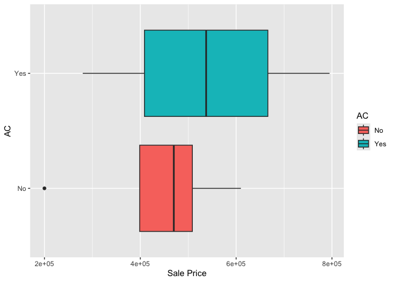

<!-- README.md is generated from README.Rmd. Please edit the README.Rmd file -->

# Step 1

``` r
colnames(ames)
```

    ##  [1] "Parcel ID"             "Address"               "Style"                
    ##  [4] "Occupancy"             "Sale Date"             "Sale Price"           
    ##  [7] "Multi Sale"            "YearBuilt"             "Acres"                
    ## [10] "TotalLivingArea (sf)"  "Bedrooms"              "FinishedBsmtArea (sf)"
    ## [13] "LotArea(sf)"           "AC"                    "FirePlace"            
    ## [16] "Neighborhood"

``` r
str(ames)
```

    ## Classes 'tbl_df', 'tbl' and 'data.frame':    6935 obs. of  16 variables:
    ##  $ Parcel ID            : chr  "0903202160" "0907428215" "0909428070" "0923203160" ...
    ##  $ Address              : chr  "1024 RIDGEWOOD AVE, AMES" "4503 TWAIN CIR UNIT 105, AMES" "2030 MCCARTHY RD, AMES" "3404 EMERALD DR, AMES" ...
    ##  $ Style                : Factor w/ 12 levels "1 1/2 Story Brick",..: 2 5 5 5 NA 9 5 5 5 5 ...
    ##  $ Occupancy            : Factor w/ 5 levels "Condominium",..: 2 1 2 3 NA 2 2 1 2 2 ...
    ##  $ Sale Date            : Date, format: "2022-08-12" "2022-08-04" ...
    ##  $ Sale Price           : num  181900 127100 0 245000 449664 ...
    ##  $ Multi Sale           : chr  NA NA NA NA ...
    ##  $ YearBuilt            : num  1940 2006 1951 1997 NA ...
    ##  $ Acres                : num  0.109 0.027 0.321 0.103 0.287 0.494 0.172 0.023 0.285 0.172 ...
    ##  $ TotalLivingArea (sf) : num  1030 771 1456 1289 NA ...
    ##  $ Bedrooms             : num  2 1 3 4 NA 4 5 1 3 4 ...
    ##  $ FinishedBsmtArea (sf): num  NA NA 1261 890 NA ...
    ##  $ LotArea(sf)          : num  4740 1181 14000 4500 12493 ...
    ##  $ AC                   : chr  "Yes" "Yes" "Yes" "Yes" ...
    ##  $ FirePlace            : chr  "Yes" "No" "No" "No" ...
    ##  $ Neighborhood         : Factor w/ 42 levels "(0) None","(13) Apts: Campus",..: 15 40 19 18 6 24 14 40 13 23 ...

``` r
head(ames)
```

    ##    Parcel ID                       Address             Style
    ## 1 0903202160      1024 RIDGEWOOD AVE, AMES 1 1/2 Story Frame
    ## 2 0907428215 4503 TWAIN CIR UNIT 105, AMES     1 Story Frame
    ## 3 0909428070        2030 MCCARTHY RD, AMES     1 Story Frame
    ## 4 0923203160         3404 EMERALD DR, AMES     1 Story Frame
    ## 5 0520440010       4507 EVEREST  AVE, AMES              <NA>
    ## 6 0907275030       4512 HEMINGWAY DR, AMES     2 Story Frame
    ##                        Occupancy  Sale Date Sale Price Multi Sale YearBuilt
    ## 1 Single-Family / Owner Occupied 2022-08-12     181900       <NA>      1940
    ## 2                    Condominium 2022-08-04     127100       <NA>      2006
    ## 3 Single-Family / Owner Occupied 2022-08-15          0       <NA>      1951
    ## 4                      Townhouse 2022-08-09     245000       <NA>      1997
    ## 5                           <NA> 2022-08-03     449664       <NA>        NA
    ## 6 Single-Family / Owner Occupied 2022-08-16     368000       <NA>      1996
    ##   Acres TotalLivingArea (sf) Bedrooms FinishedBsmtArea (sf) LotArea(sf)  AC
    ## 1 0.109                 1030        2                    NA        4740 Yes
    ## 2 0.027                  771        1                    NA        1181 Yes
    ## 3 0.321                 1456        3                  1261       14000 Yes
    ## 4 0.103                 1289        4                   890        4500 Yes
    ## 5 0.287                   NA       NA                    NA       12493  No
    ## 6 0.494                 2223        4                    NA       21533 Yes
    ##   FirePlace              Neighborhood
    ## 1       Yes       (28) Res: Brookside
    ## 2        No    (55) Res: Dakota Ridge
    ## 3        No        (32) Res: Crawford
    ## 4        No        (31) Res: Mitchell
    ## 5        No (19) Res: North Ridge Hei
    ## 6       Yes   (37) Res: College Creek

``` r
max(ames$`Sale Price`)
```

    ## [1] 20500000

As a team we saw that there are numeric and categorical variables. Some
of the numeric variables are TotalLivingArea (sf), Sale Price, Year
Built, Acres, etc. Some of the categorical variables are Fire Place, AC,
Multi Sale, etc. The categorical are either Yes or No. We would predict
the sale price ranging from 0-3 million.

# Step 2 The variable of interest is “Sale Price”

# Step 3

``` r
library(ggplot2)
salePriceGraph <- ggplot(ames, aes(x=`Sale Price`)) + 
  geom_histogram(binwidth = 500000)

print(salePriceGraph)
```

<!-- -->

As a team when exploring the Sale Price variable through the histogram.
Most homes look to be between 75k to 150k. There are some outliers where
some homes are in the millions but not many at all.

# Step 4

Selena Cooper:

``` r
sqftPlot <- ggplot(ames |> dplyr::filter(`Sale Price` != 0) |> na.omit(), aes(x=AC, y = `Sale Price`, fill = AC))+
                     geom_boxplot() + coord_flip()
print(sqftPlot)
```

<!-- -->

I removed the zeros because there were a lot in the dataset so I could
look at the AC variable affecting Sale Price. IF the house has AC then
it is more expensive. There are many outliers as well. The range of the
AC variable is either the house has it or it doesn’t becuase it is
categorical.

Jyotika Sharma:

``` r
yearBuilt <- ggplot(ames |> dplyr::filter(`Sale Price` >  0) |> na.omit(), aes(x = `Sale Price`, y = `TotalLivingArea (sf)`)) +
  geom_point()

print(yearBuilt)
```

<!-- -->

I removed the zeros because most of the house in Ames in 2017 where
causing the dataset to look skewed when exploring the scatter plot
between Sale Price and the Total Living Area (sf). I also got rid of
missing values. From the following points left, we can see that as the
Sale price goes up, the total living area is higher. However, there are
still points on that don’t follow that correlation.

Grace Kolker

``` r
Bedrooms <- ggplot(ames |> dplyr::filter(`Sale Price` != 0) |> na.omit(), aes(x=`Sale Price`)) + 
                     geom_bar() + facet_wrap ( ~ Bedrooms) 
print(Bedrooms)
```

<!-- -->

This faceted bar chart shows the relationship between sales price and
number of bedrooms. The chart shows that the more bedrooms a house has,
the higher the sale price. I removed all the zeros and missing values
which helped clean the data. The outliars skewing the data were coming
from the missing values as well, that is why their are fewer points on
the chart.
